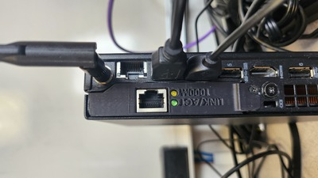

# Dirac

> The Lenovo Tiny Cluster

## Information

Originally designed for the [Governor's School of Emerging Technologies](https://www.tntech.edu/education/stem/gset.php)
in 2025, the Dirac cluster is our premier way of showcasing HPC architecture. It includes
some custom peices of software dedicated to visualizing parallel programs such as the
[SPH Particle Simulation](https://github.com/TNTech-RCD/SPH) program.
This system is built with OpenHPC 3, Rocky 4, Rocky 9, and SLURM.

## Node Setup

### Locating Hardware

You will need the `sms-plus` and the first four compute nodes: `c1`, `c2`, `c3`, and `c4`.

The `sms-plus` is the node with dual-NICs and a WiFi antenna:



The compute nodes ought to have a labels for what their hostnames and MAC addresses are.

Look for:
- `c1`, `E8:6A:64:F6:7C:CD`
- `c2`, `E8:6A:64:F6:7C:CF`
- `c3`, `E8:6A:64:F6:7C:F7`
- `c4`, `E8:6A:64:F6:7D:E7`

### Getting Connected

The compute nodes and the sms-plus will all have a connection to an isolated, private
network. Other than basic networking equipment, these should be the _only_ devices
connected. (eg. Ensure no rogue DHCP servers, DNS servers, or otherwise)

_***Note:*** Use the expansion NIC (the network interface with the 3D-printed bracket) as 
the link to the internal network._

_***Note 2:*** Astute readers may realize this means the compute nodes do not have
access to the Internet. Unless the sms-plus is configured to run as a router,
they would be correct._

Now the nodes can be plugged in. The compute nodes may be set to auto power on once
plugged in, so get the sms-plus turned on first.


## Running the Simulation

When powered on, the sms-plus node will auto log-on to the `demo` user. On that
user's desktop, there should be a shortcut `run_sph.sh` that you can run in the right-click
context menu.

_Should it fail to run_, you can verify the SLURM configuration with `sinfo`. You may need to set
the state of the downed nodes to 'resume'. See the SLURM section.

The application that is now running is our own fork of [the SPH particle simulation](https://github.com/TNTech-RCD/SPH). The following Controls section comes from that repository:

### Controls

The input controls are set in `GLFW_utils.c` and `EGL_utils.c` for GLFW and Raspberry Pi platforms respectively. The Pi's controls are based upon using an XBox controller to handle input.

Although subject to change generally keys should operate as follows:

* The `esc` key exists the simulation under macOS. On other platform `esc` toggles the exit menu, hover the oak leaf over the `terminal` image and press `a` to exit.

* Arrow keys should change the paramaters in the top left of the screen

* The mouse controlls the mover sphere

* `a`,`b`,`x`,`y` are fluid parameter presets

* on Mac `[` `]` controls the number of processes while on the Pi it is page up and page down.

* `l` toggles between particle and liquid surface rendering methods

If the keyboard input for the RaspberyPi doesn't work you may need to correctly set `/dev/input/event#` in `get_key_press()` in `egl_util.c` 

## SLURM

SLURM is configured with 4 official 'compute' nodes, and the sms-plus machine itself.
Due to the graphical nature of the application, we need a node in SLURM that is running a
display server. In this case, we are reusing the sms node for display purposes.

All configuration lives in `/etc/slurm/slurm.conf`.

### Troubleshooting

With `sinfo`, you should see the compute nodes `c[1-4]` show an 'idle' state. If that is not
the case, keep reading.

If the output of `sinfo` looks like this:
```
[rcd@sms-plus ~]$ sinfo
PARTITION AVAIL  TIMELIMIT  NODES  STATE NODELIST
normal*      up 1-00:00:00      1   idle sms-plus
normal*      up 1-00:00:00      4   down c[1-4]
```
all you will need to do is set the state of the nodes to 'resume'. Try
`sudo scontrol update nodename=c[1-4] state=resume`.

If the output of `sinfo` looks like this:
```
[rcd@sms-plus ~]$ sinfo
PARTITION AVAIL  TIMELIMIT  NODES  STATE NODELIST
normal*      up 1-00:00:00      4  down* c[1-4]
normal*      up 1-00:00:00      1   idle sms-plus
```
The compute nodes are not found. You may need to ensure network connectivity and MAC addresses.

## Users

- `demo`: unpriveleged user meant to showcase the parallel applications
- `rcd`: management user, good for kicking SLURM into shape
